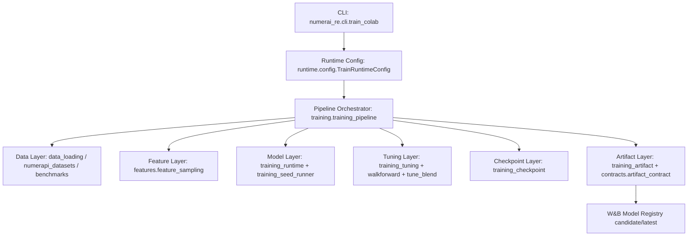
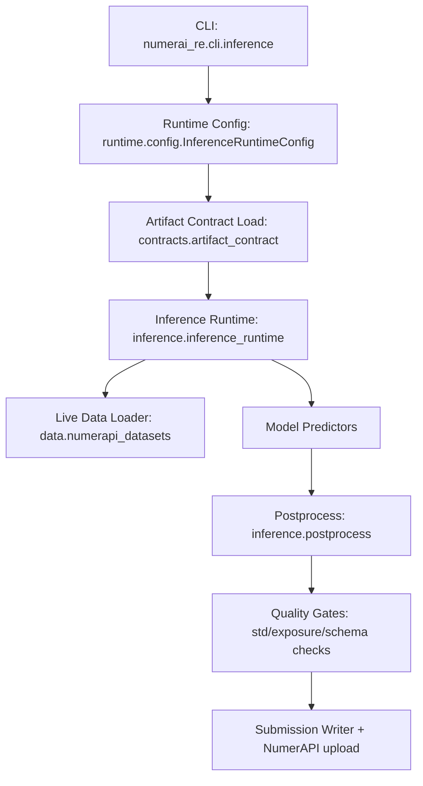

# NumerAI Hybrid-Cloud MLOps

This repository runs a **remote-train / auto-submit** system:
- Training runs in Colab and logs versioned model artifacts to W&B.
- Inference runs in GitHub Actions, pulls the promoted artifact, applies quality gates, and submits to NumerAI.
- Promotion is a manual workflow that validates candidate artifacts before moving them to `prod`.

## Quickstart

### Train in Colab
1. Open `notebooks/train_colab.ipynb`.
2. Set Colab secret `WANDB_API_KEY`.
3. Run setup cell, then run training cell (launches `python -m numerai_re.cli.train_colab`).

### Run inference in GitHub Actions
1. Configure required repo secrets: `NUMERAI_PUBLIC_ID`, `NUMERAI_SECRET_KEY`, `NUMERAI_MODEL_NAME`, `WANDB_API_KEY`, `WANDB_ENTITY`, `WANDB_PROJECT`.
2. Trigger `.github/workflows/submit.yml` manually or wait for schedule.

## Repository Structure

```text
.
├─ artifacts/
├─ docs/
│  ├─ env_reference.md
│  └─ SMOKE_TESTS.md
├─ notebooks/
├─ src/
│  └─ numerai_re/
│     ├─ cli/            # train/infer/promote entry modules
│     ├─ contracts/      # artifact and manifest contract checks
│     ├─ runtime/        # runtime config parsing from env
│     ├─ data/           # dataset and benchmark loading/alignment
│     ├─ features/       # feature sampling
│     ├─ metrics/        # NumerAI metrics and neutralization math
│     ├─ common/         # shared utilities
│     ├─ training/       # training pipeline internals
│     └─ inference/      # inference runtime and postprocess
├─ tests/
│  ├─ integration/
│  └─ unit/
└─ tools/
```

## Train Pipeline Structure



- Contains: config parsing, dataset acquisition, benchmark alignment, feature subset strategy, walk-forward tuning, seed ensemble training, checkpoint/resume, and artifact publication.
- Output: trained LightGBM model files + manifest/features/postprocess contract files in artifact storage.

## Inference Pipeline Structure



- Contains: promoted artifact retrieval, manifest compatibility checks, live feature loading, ensemble prediction, postprocessing, and drift/quality gating.
- Output: validated submission predictions uploaded to NumerAI (or dry-run artifacts locally).

## Environment Variables

- Full reference moved to `docs/env_reference.md`.
- Runtime defaults and parsing logic are defined in:
  - `src/numerai_re/runtime/config.py`
- Minimum required by context:
  - Training (Colab): `WANDB_API_KEY`
  - Inference (GitHub Actions): `NUMERAI_PUBLIC_ID`, `NUMERAI_SECRET_KEY`, `NUMERAI_MODEL_NAME`, `WANDB_API_KEY`, `WANDB_ENTITY`, `WANDB_PROJECT`

## Local Checks

Run from repository root:

```bash
PYTHONPATH=src python -m py_compile src/numerai_re/cli/train_colab.py src/numerai_re/cli/inference.py src/numerai_re/runtime/config.py src/numerai_re/cli/promote_model.py
ruff check src
PYTHONPATH=src python -m tools.validate_pipeline --dry-run
PYTHONPATH=src TRAIN_DRY_RUN=true python -m numerai_re.cli.train_colab
PYTHONPATH=src INFER_DRY_RUN=true python -m numerai_re.cli.inference
```
