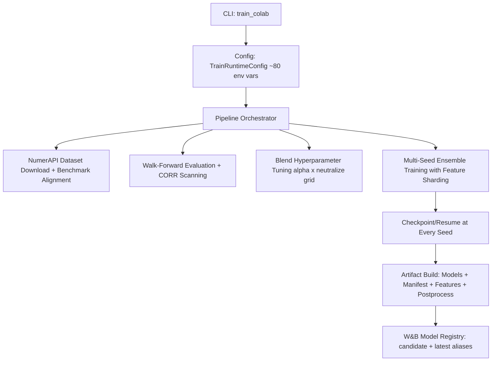
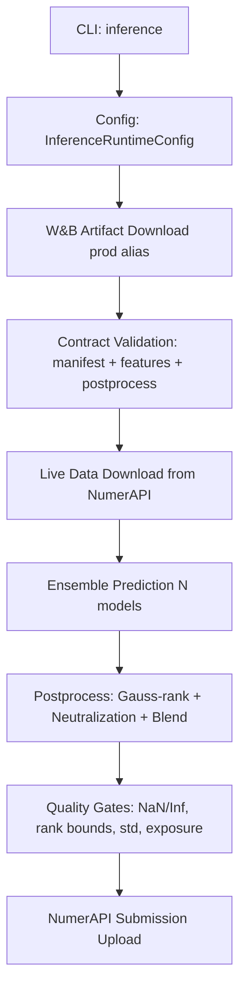

# NumerAI Hybrid-Cloud MLOps Pipeline

> End-to-end automated machine learning system for the [NumerAI](https://numer.ai/) hedge fund tournament: trains LightGBM ensemble models in Google Colab, versions artifacts through Weights & Biases, and submits live predictions via scheduled GitHub Actions — fully autonomous, zero manual intervention required after setup.

---

## Architecture Overview

```
Google Colab (GPU)                  GitHub Actions (scheduled)
 ┌──────────────┐                    ┌────────────────────┐
 │  Train CLI   │                    │   Inference CLI     │
 │  (notebook)  │                    │   (cron: Tue-Sat)   │
 └──────┬───────┘                    └────────┬───────────┘
        │                                     │
        ▼                                     ▼
 ┌──────────────┐    promote     ┌────────────────────┐
 │  W&B Model   │───(manual)──▶  │  W&B Model Registry │
 │  Registry    │   validation   │  (prod alias)       │
 │  (candidate) │                └────────┬───────────┘
 └──────────────┘                         │
                                          ▼
                                 ┌────────────────────┐
                                 │  NumerAI Tournament │
                                 │  (live submission)  │
                                 └────────────────────┘
```

**Training** runs on-demand in Colab with GPU acceleration — fits walk-forward-tuned LightGBM ensembles across multiple seeds, tunes blend/neutralization hyperparameters via grid search over walk-forward windows, and publishes versioned artifacts (model files + contract metadata) to W&B.

**Inference** runs automatically on a cron schedule — downloads the promoted production artifact, loads live tournament data from NumerAI, runs ensemble predictions with postprocessing (Gauss-rank normalization, benchmark neutralization, alpha blending), applies quality gates (NaN/Inf checks, rank bounds, prediction std, feature exposure drift), and uploads validated submissions to NumerAI.

**Promotion** is a manual gate — validates artifact integrity (manifest schema, model file existence, feature mappings, postprocess config) before aliasing a candidate to `prod`.

---

## Key Features

| Feature | Description |
|---|---|
| **Walk-forward cross-validation** | Trains on rolling era windows with configurable chunk sizes and purge gaps to avoid lookahead bias |
| **Multi-seed ensemble** | Trains N independent LightGBM models with sharded feature subsets for diversity, then blends predictions |
| **Automated hyperparameter tuning** | Grid search over blend alpha and benchmark neutralization proportion using walk-forward windows with CORR + BMC objective |
| **Checkpoint/resume** | Signature-based checkpointing at seed, walk-forward, and blend-tuning stages — recovers from Colab preemptions |
| **Artifact contract system** | JSON-based contract (manifest, features, postprocess config) enforced by both training and inference pipelines |
| **Quality gates** | Pre-submission validation: NaN/Inf detection, rank-bound verification, prediction std floor, max absolute feature exposure |
| **Dry-run mode** | Full pipeline smoke testing with synthetic data — runs in CI on every PR |
| **Automated alerting** | Failed submissions auto-create GitHub Issues with structured metadata for triage |
| **Scheduled retry windows** | Multiple cron slots per round day with single-attempt-per-run policy |

---

## Tech Stack

| Layer | Technology |
|---|---|
| **ML Framework** | LightGBM (gradient-boosted decision trees) |
| **Data Processing** | Polars (training), Pandas + PyArrow (inference), NumPy |
| **Statistical Methods** | SciPy (Gauss-rank transforms, OLS neutralization, tie-rank correlation) |
| **Experiment Tracking** | Weights & Biases (run logging, model registry, artifact versioning) |
| **Training Compute** | Google Colab (T4/A100 GPU, with CPU fallback + GPU probe) |
| **CI/CD** | GitHub Actions (lint, dry-run, scheduled inference, manual promotion) |
| **Tournament API** | NumerAPI (data download, prediction submission, model validation) |
| **Code Quality** | Ruff (linting), `compileall` (syntax), contract validation tooling |
| **Language** | Python 3.9+ with type annotations throughout |

---

## Repository Structure

```
src/numerai_re/
  config.py              # Runtime config: ~80 env vars parsed into frozen dataclasses
  contracts.py           # Artifact contract: manifest/features/postprocess schema validation
  shared.py              # Shared utilities: era parsing, status reporting, feature sampling, NumerAI metrics
  cli/
    inference.py          # Inference entrypoint (GitHub Actions + local)
    train_colab.py        # Training entrypoint (Colab notebook)
    promote_model.py      # Model promotion entrypoint (manual workflow)
  data/
    loading.py            # Parquet data loading with numpy caching
    numerapi_datasets.py  # NumerAPI dataset resolution (int8/float32 auto-detection)
    benchmarks.py         # Benchmark download, alignment, and coverage validation
  inference/
    runtime.py            # Live inference: data loading, prediction, submission, quality gates
    postprocess.py        # Gauss-rank, benchmark neutralization, alpha blending, feature neutralization
  training/
    pipeline.py           # Main training orchestrator: config -> data -> tune -> train -> artifact
    runtime.py            # Model fitting, early stopping, CORR scanning, seed training loop
    tuning.py             # Walk-forward evaluation and blend hyperparameter grid search
    checkpoints.py        # Generic + training-specific checkpoint I/O with signature validation
    artifact.py           # Artifact packaging and W&B registry upload
    dry_run.py            # Synthetic dry-run for CI smoke testing
    walkforward.py        # Walk-forward window construction
tools/
  validate_pipeline.py    # Artifact contract validation CLI
tests/                    # Unit + integration tests
notebooks/
  train_colab.ipynb       # Thin Colab notebook (setup + single CLI dispatch)
.github/workflows/
  submit.yml              # Scheduled inference submission (Tue-Sat cron)
  ci.yml                  # PR/push: lint + dry-run validation
  promote-model.yml       # Manual model promotion
```

---

## Pipeline Details

### Training Pipeline


```mermaid
flowchart TD
  A[CLI: train_colab] --> B[Config: TrainRuntimeConfig ~80 env vars]
  B --> C[Pipeline Orchestrator]
  C --> D[NumerAPI Dataset Download + Benchmark Alignment]
  C --> E[Walk-Forward Evaluation + CORR Scanning]
  C --> F[Blend Hyperparameter Tuning alpha x neutralize grid]
  C --> G[Multi-Seed Ensemble Training with Feature Sharding]
  G --> H[Checkpoint/Resume at Every Seed]
  H --> I[Artifact Build: Models + Manifest + Features + Postprocess]
  I --> J[W&B Model Registry: candidate + latest aliases]
```

- **Input**: NumerAI tournament dataset (v5.x, ~1M rows, ~2000+ features)
- **Method**: LightGBM with walk-forward-tuned iteration count, per-seed sharded feature subsets, benchmark-model neutralization
- **Output**: Versioned artifact containing N model files + JSON contract metadata

### Inference Pipeline


```mermaid
flowchart TD
  A[CLI: inference] --> B[Config: InferenceRuntimeConfig]
  B --> C[W&B Artifact Download prod alias]
  C --> D[Contract Validation: manifest + features + postprocess]
  D --> E[Live Data Download from NumerAPI]
  E --> F[Ensemble Prediction N models]
  F --> G[Postprocess: Gauss-rank + Neutralization + Blend]
  G --> H[Quality Gates: NaN/Inf, rank bounds, std, exposure]
  H --> I[NumerAPI Submission Upload]
```

- **Trigger**: GitHub Actions cron (multiple windows per round day) or manual dispatch
- **Safety**: Dry-run mode, drift guard abort, automated GitHub Issue on failure
- **Output**: Validated CSV submission uploaded to NumerAI tournament

---

## Quickstart

### Train in Colab
1. Open `notebooks/train_colab.ipynb`
2. Set Colab secret `WANDB_API_KEY`
3. Run all cells (setup + single CLI dispatch)

### Inference via GitHub Actions
1. Configure repo secrets: `NUMERAI_PUBLIC_ID`, `NUMERAI_SECRET_KEY`, `NUMERAI_MODEL_NAME`, `WANDB_API_KEY`, `WANDB_ENTITY`, `WANDB_PROJECT`
2. Trigger `.github/workflows/submit.yml` manually or wait for schedule (Tue-Sat)
3. Manual dispatch supports `dry_run` mode for safe testing

### Promote a Model
```bash
# Validates candidate artifact, then aliases to prod
python -m numerai_re.cli.promote_model
```

---

## Environment Variables

Full reference: [`docs/env_reference.md`](docs/env_reference.md)

Runtime config parsing: `src/numerai_re/config.py`

**Required by context:**
- Training (Colab): `WANDB_API_KEY`
- Inference (GitHub Actions): `NUMERAI_PUBLIC_ID`, `NUMERAI_SECRET_KEY`, `NUMERAI_MODEL_NAME`, `WANDB_API_KEY`, `WANDB_ENTITY`, `WANDB_PROJECT`

---

## CI / CD

| Workflow | Trigger | Jobs |
|---|---|---|
| `ci.yml` | PR + push to main | `lint-compile` (ruff + compileall), `dry-run-pipeline` (train + validate + infer) |
| `submit.yml` | Cron (Tue-Sat) + manual | Download artifact, run inference, upload to NumerAI, alert on failure |
| `promote-model.yml` | Manual dispatch | Validate candidate artifact, alias to `prod` in W&B |

---

## Local Checks

```bash
PYTHONPATH=src python -m compileall -q src tests tools
ruff check src
PYTHONPATH=src python -m tools.validate_pipeline --dry-run --artifact-dir artifacts/mock_prod
PYTHONPATH=src TRAIN_DRY_RUN=true python -m numerai_re.cli.train_colab
PYTHONPATH=src INFER_DRY_RUN=true python -m numerai_re.cli.inference
PYTHONPATH=src python -m tools.performance_tracker
```

The performance tracker command writes timestamped raw payloads, normalized history, and a manual-staking recommendation to `artifacts/performance/`.
